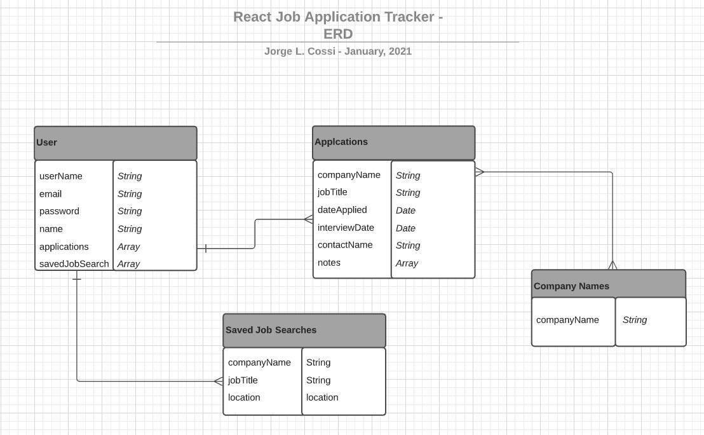
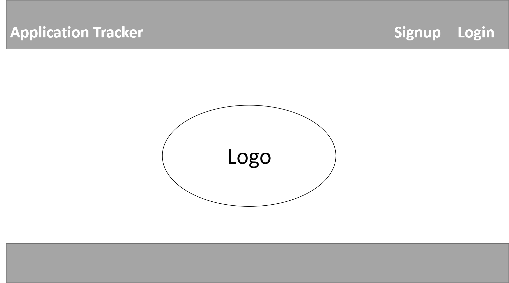
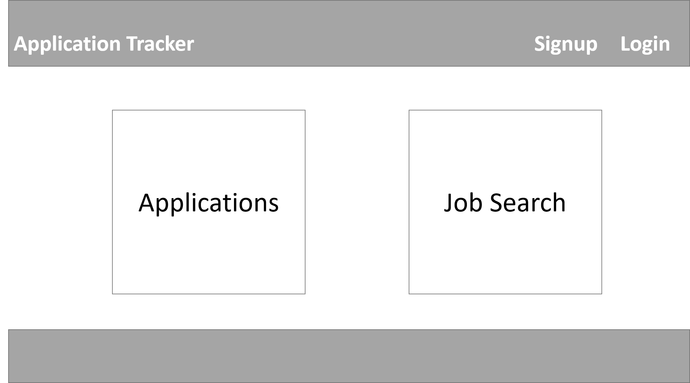
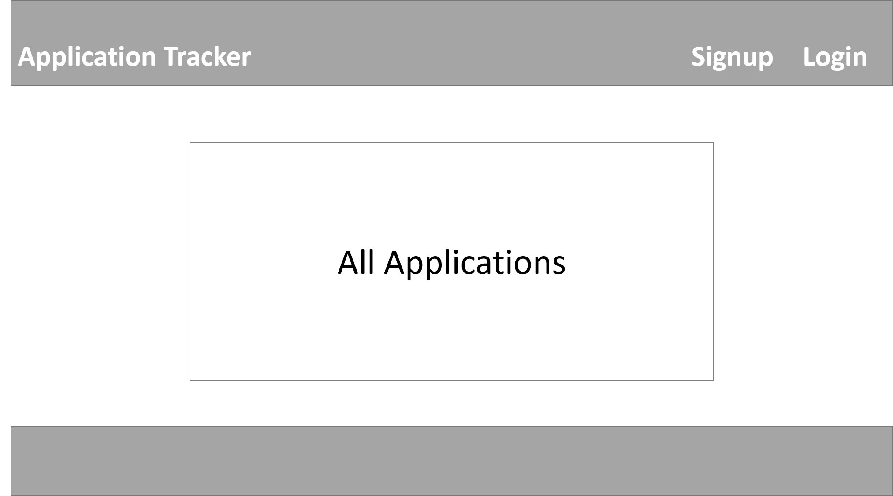
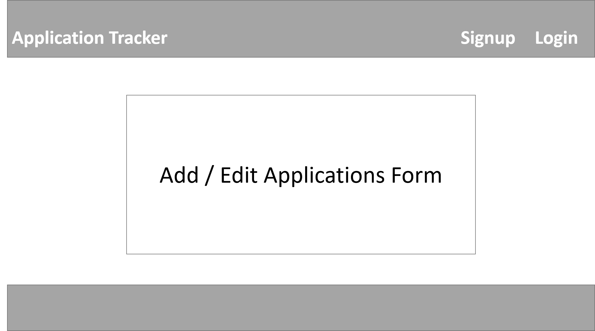
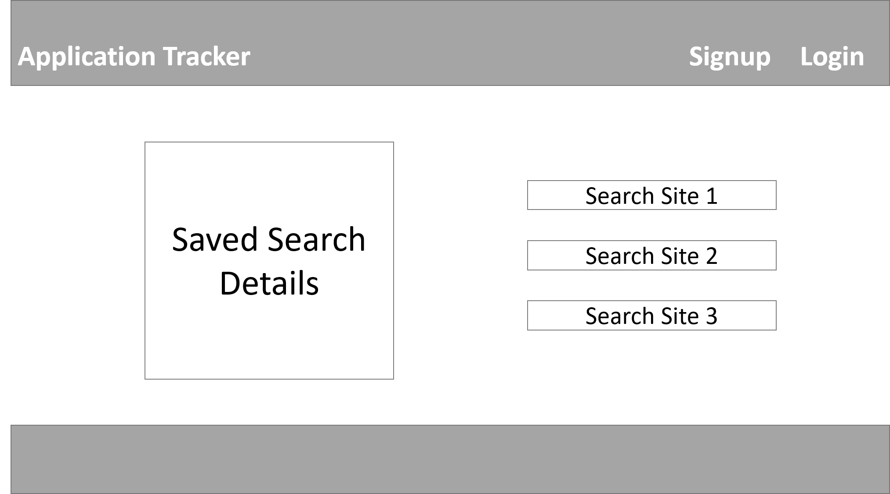

## MERN Job Search App

This app can be used to track all the job applications submitted during a job seach.  You will be able to:
* Create an account and login with credentials 

* Add the following information about the job you applied for:
  * Company Name
  * Position Applied For (optional)
  * Date Applied (optional)
  * Interview Date (optional)
  * Name of Contact at Company (optional)
  * Notes about application (optional)
* Edit or Delete application entry

* Save Job Searches with at least one of the following information:
  * Company Name / Position / Keyword
  * City to search in 
  * State to search in 
* Use saved searches in sites like Indeed, Monster, CareerBuilder, Muse
* Delete saved search

* Application / Job Search info will persist even after you've logged out

## Entity Relationship Diagram
 

## Wireframe
 

 

 

 

 

 

## Technologies Used
* MongoDB
* Express
* React
* Node.JS
* Mongoose
* CSS3
* Google Fonts
* React-Bootstrap

## Getting Started
Click [here](https://mern-job-search-tracker.netlify.app/) to get started. 
 

## Future Enhancements
- [] Allow job search functionality without loggin in
- [] Add functionality for creating and storing resumes
